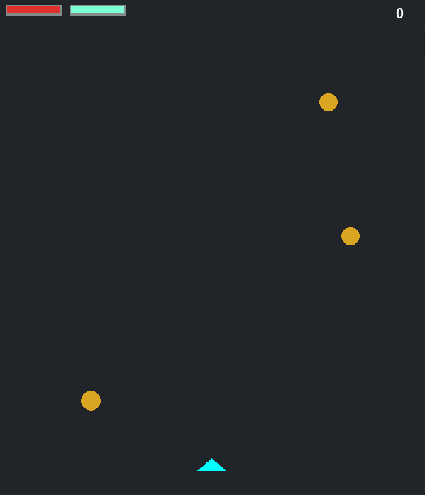

<h1 align="center">PyAsteroids</h1>

Este jogo foi inspirado no clássico arcade Asteroids e foi desenvolvido utilizando a biblioteca Pygame. A ideia principal era criar uma experiência visualmente agradável e descomplicada, enquanto por trás das cenas, processos mais avançados estão em ação.

## História do Jogo
Devido às consequências das ações humanas na Terra, a decisão de evacuar o planeta é tomada pela humanidade. No entanto, essa jornada rumo a um novo lar não é sem obstáculos. Para enfrentar os desafios que surgem no caminho, é formada uma unidade especial dedicada a desbravar a rota para o próximo planeta habitável. Seu objetivo principal é minimizar os riscos iminentes e garantir uma passagem segura para a humanidade.

## Requisitos
- [Pygame](https://www.pygame.org/news)
- [Python](https://www.python.org/downloads/release/python-3114/)

## Como instalar ?
- **Primeiramente** você precisa baixar o arquivos do repositório no botão de **Download Zip**.
- **Segundamente** você precisa ter o Python instalado.
- **Terceiramente** abra um terminal na pasta do jogo, e digite `pip install -r requirements.txt`.

## Como jogar ?
- Inicie o jogo usando o comando no terminal: `python main.py`.
- Usando as teclas `A` e `D`, você consegue mover a nave.
- Usando a tecla `Espaço`, a nave irá disparar um laser.
- Usando a tecla `P`, irá pausar o jogo. Já a tecla `R` irá reiniciar.